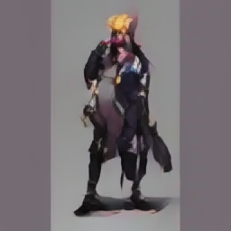
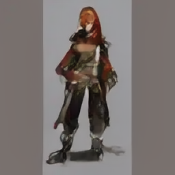
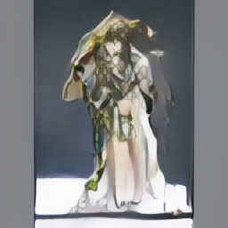
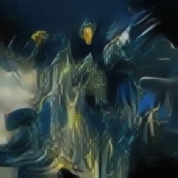
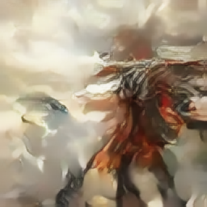

# Standalone Hierarchical Binary Quantization extracted from GRN (arXiv 2604.13030 (Han et al., 2026))

The quantizer in the GRN paper is useful outside of GRN, so I re-implemented it as a separate module.

## Usage

```python
import hierarchical_binary_quantization.hbq as hbq
import torch
batches, vector_lenght = 3,8
z = torch.rand(batches,vector_lenght) * 2 - 1
```

or as a nn.Module for image models that passes gradients through the quantization step:

```python
# 1. Create test tensor dimension [BATCH, CHANNELS, H, W]
x = torch.tensor([[[[-0.7,-0.2]],[[0.2,0.7]]]], requires_grad=True)
# 2. Pass it through the quantizer
quantizer = hbq.HBQQuantizer(n_rounds=2)
q_out, aux = quantizer(x)
# 3. Compute a loss
loss = (q_out ** 2).sum()
# 4. Compute gradients
loss.backward()
# 5. Print results to verify
import IPython.display as ipd
cleanstr = lambda x: str(x).replace("\n"," ")
ipd.display(ipd.Markdown(f"""
# Validation Results
* Original Input x: `{cleanstr(x)}`
* Quantized Output q_out:  `{cleanstr(q_out)}`
* bit_codes:  `{cleanstr(aux.bit_codes)}`")
* Token IDs q_out:  `{aux.tokens}`")
* Do gradients exist? `{x.grad is not None}`")
* Computed Gradients x.grad: `{cleanstr(x.grad)}`")
"""))
```


## Example images

Example images generated by a latent diffusion model using the Example Quantizing Autoencoder in this model:

     
